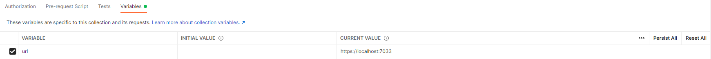
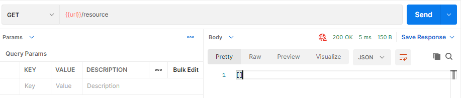

= API Platform

ユーザが動的にリソースを作成および利用できる汎用的なAPI基盤。

※ 開発中

== DEMO

== Usage

=== Requirements

.実行環境
* https://docs.microsoft.com/ja-jp/dotnet/core/install/[.NET 6]
* Docker

.ツール
* https://code.visualstudio.com/[Visual Studio Code] (開発環境)
* https://www.postman.com/[Postman] などの Web API テストツール
* https://dbeaver.io/[DBeaver] などのSQLクライアントツール

=== Installation

. docker ディレクトリ内で `docker-compose up -d` を実行する。

. docker/.env ファイルのデータベース接続情報を書き換える。

. DBeaver を用いてデータベースにアクセスする。アクセス情報の例は以下。(.envファイルを書き換えていない場合)
+
* Host: localhost
* Port: 5432
* データベース名: db
* ユーザ名: root
* パスワード: pass

. docker/ddl.sql ファイルのテーブル生成SQLを実行する。

. VS Code で Gsuke.ApiPlatform ディレクトリを開く。

. Ctrl + F5 キーを押下してプロジェクトを実行する。

. Postman を用いて https://localhost:7033/resource にアクセスし、 `[]` が返却されることを確認する。
+

+

=== Tutorials

※ 執筆中

== License

link:LICENSE[MIT LICENSE]

== 今後の予定

* 自動テストを実装
* デプロイ
